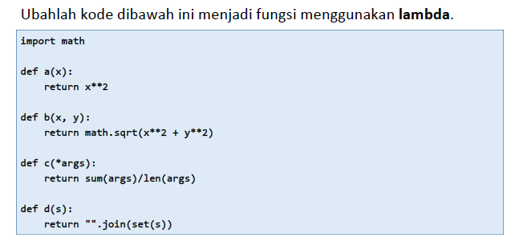

# Pratikum 6

## Latihan – Fungsi



### A. Program

![img] screenshot/2.png

### B. Penjelasan

1. Gunakan `import math` yang berfungsi agar program dapat menggunakan semua fungsi yang ada pada modul math. 

```python
import math
```

2. Menggunakan fungsi lambda :

	* Perpangkatan
        ```pyhton
        # def a(x):
        #    return x**2
        a = lambda x : x**2
        print (a(6))
        ```
    * Perpangkatan dan Penjumlahan
        ```python
        # def b(x, y):
        #    return math.sqrt(x**2 + y**2)
        b = lambda x, y : x**2 + y**2
        print (b(7, 2))
        ```
    * Rata-rata
        ```python
        # def c(*args):
        #   return sum(args)/len(args)
        c = lambda *args : sum(args)/len(args)
        print (c(5, 10, 25))
        ```
    * Mengubah posisi nilai yang diinputkan (tidak beraturan) 
        ```python
        # def d(s):
        #    return "".join(set(s))
        d = lambda s : "".join(set(s))
        print (d("Apel"))
        ```

### C. Output

![img] screenshot/3.png

## Tugas Pratikum

### A. Program

![img] screenshot/

### B. Penjelasan

1. Membuat dictionary kosong sebagai database.

    ```python
    daftar = {}
    ```
2. Membuat fungsi tambahan, jika diperlukan fungsi tersebut akan dipanggil oleh program.

    ```python
    def no_data():
    print("DAFTAR NILAI")
    print("------------")
    print(72*"=")
    print("| {0:^10} | {1:^10} | {2:^6} | {3:^6} | {4:^6} |   {5:^12}  |".format("NIM", "NAMA", "TUGAS", "UTS", "UAS", "NILAI AKHIR"))
    print(72*"=")
    print("|                             TIDAK ADA DATA                           |")
    print(72*"=")
    print()
    ```

3. Menampilkan atau melihat data ( **lihat()** )
    * Jika belum menginput data, maka akan memanggil fungsi `no_data()`.

        ```python
        def lihat():
        if len(daftar) <= 0:
            no_data()
        else:
            print("DAFTAR NILAI")
            print("------------")
            print(72*"=")
            print("| {0:^10} | {1:^10} | {2:^6} | {3:^6} | {4:^6} |   {5:^12}  |".format("NIM", "NAMA", "TUGAS", "UTS", "UAS", "NILAI AKHIR"))
            print(72*"=")
            for z in daftar.items():
                print(f"| {z[1][0]:>10} | {z[0]:>10} | {z[1][1]:>6} | {z[1][2]:>6} | {z[1][3]:>6} |   {z[1][4]:>12}  |") 
                print(72*"=")
            print()
        ```
    #### Output - lihat()

    ![img] screenshot

4. Menambahkan data ( **tambah()** )
    * Menginput nim, nama, nilai tugas, nilai uts dan nilai uas.
    * Data yang telah diinput tadi, akan ditambahkan ke dalam dictionary `daftar` dengan **nama** sebagai keys dan sisanya sebagai **values**.

        ```python
        def tambah():
        print("TAMBAH DATA")
        print("------------")
        nama = input("Nama Mahasiswa\t: ")
        nim = int(input("NIM Mahasiswa\t: "))
        tugas = int(input("Nilai Tugas\t: "))
        uts = int(input("Nilai UTS\t: "))
        uas = int(input("Nilai UAS\t: "))
        akhir = (tugas*30/100) + (uts*35/100) + (uas*35/100)
        daftar[nama] = [nim, tugas, uts, uas, akhir]
        print()
        ```
    #### Output - tambah()

    ![img] screenshot

5. Mengubah data ( **ubah()** )
    * Menginput nama sebagai key.
    * Setelah menginput nama, input data yang ingin diubah. 

        ```python
        def ubah():
        if len(daftar) <= 0:
            no_data()
        else :
            print("UBAH DATA")
            print("-----------")
            nama = input("Nama Anda\t: ")
            if nama in daftar.keys():
                nim = int(input("NIM Mahasiswa\t: "))
                tugas = int(input("Nilai Tugas\t: "))
                uts = int(input("Nilai UTS\t: "))
                uas = int(input("Nilai UAS\t: "))
                akhir = (tugas*30/100) + (uts*35/100) + (uas*35/100)
                daftar[nama] = [nim, tugas, uts, uas, akhir] 
                print()
        ```
    #### Output - ubah()

    ![img] screenshot

6. Menghapus data ( **hapus()** )
    * Menginput nama sebagai key data yang ingin dihapus.
    * Setelah menginput nama, maka data yang lain akan ikut terhapus sesuai dengan nama yang diinput.

        ```python
        def hapus():
        if len(daftar) <=0:
            no_data()
        else:
            print("HAPUS DATA")
            print("-----------")
            nama = input("Nama Anda\t: ")
            if nama in daftar.keys():
                del daftar[nama]
                print()
        ```

6. Menggunakan perulangan uncountable, yang artinya selama statement bernilai **True** maka program akan terus berjalan. Jika statementnya **False** maka program terhenti.

    ```python
    Loop = True
    while Loop:
        print("Pilih Menu")
        print()
        tanya = input("[(L)ihat, (T)ambah, (U)bah, (H)apus, (K)eluar] : ")
        print()

        if tanya=="l" or tanya=="L":
            lihat()
        
        elif tanya=="t" or tanya=="T":
            tambah()
        
        elif tanya=="u" or tanya=="U":
            ubah()
        
        elif tanya=="h" or tanya=="H":
            hapus()
        
        elif tanya=="k" or tanya=="K":
            print("Program Selesai")
            Loop = False
    ```
### Sekian Terimakasih
